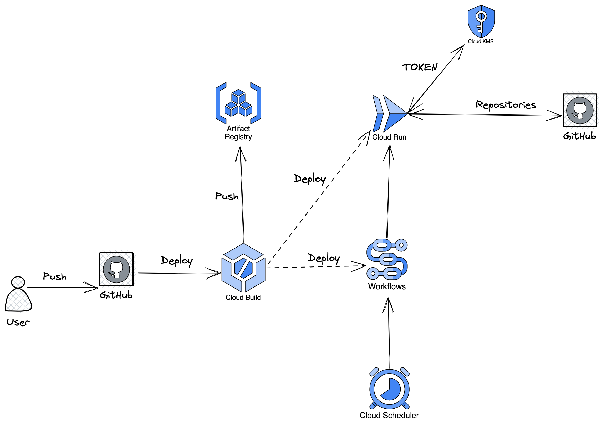

# Cloud Run Jobs Demo

## Downloading Starred Repositories

This project is a demonstration of how to use Google Cloud Run Jobs to periodically download
and update a user's starred repositories from the GitHub API.
It includes a sample Cloud Run Job that uses the GitHub API to fetch the list of
repositories starred by a specified user and log them in order to route those logs to a sink such as BigQuery.

## Prerequisites

To run the demo, you will need:

* A Google Cloud account with access to the Google Cloud Run, Cloud Workflow, and Cloud Scheduler services.
* The Google Cloud SDK, which includes the gcloud command-line tool for managing Google Cloud resources.
* A GitHub personal access token with the public_repo scope, which will be used to authenticate the GitHub API requests.

## Running the demo

To run the demo, follow these steps:

Clone or download the [Cloud Run Jobs Demo](https://github.com/veggiemonk/cloud-run-jobs-demo) repository to your local machine.
Open a terminal and navigate to the root directory of the project.

```bash
git clone https://github.com/veggiemonk/cloud-run-jobs-demo
cd cloud-run-jobs-demo
```

### Locally

Set the environment variable `GITHUB_TOKEN` to your GitHub personal access token:

```bash
./build.sh
export GITHUB_TOKEN=<your-github-token>
./bin/batch --username <your-github-username> --github-token $GITHUB_TOKEN
```

### In Cloud Run

Use the gcloud tool to authenticate and set your default project and region:

```bash
gcloud auth login

gcloud config set project <your-project-id>

gcloud config set run/region <your-preferred-region>
```

> Read the `setup.sh` script to understand what is needed to run the demo.

```bash
cat setup.sh
```

Here is a sample of what will be deployed:



## Start presentation

```bash
 go get golang.org/x/tools/cmd/present # install present binary in your $GOPATH
 make presentation
```

## Resources

* [3 ways to embed a commit hash in Go programs](https://developers.redhat.com/articles/2022/11/14/3-ways-embed-commit-hash-go-programs#)
* [Learning Go by examples Series](https://dev.to/aurelievache/series/13751) by [Aurélie Vache](https://dev.to/aurelievache)
* [The best Go framework](https://threedots.tech/post/best-go-framework/)
* [Go structured logging proposal](https://go.googlesource.com/proposal/+/master/design/56345-structured-logging.md)
* [Run bash script in Cloud Build](https://cloud.google.com/build/docs/configuring-builds/run-bash-scripts)
* [Cloud Run container contract](https://cloud.google.com/run/docs/container-contract#env-vars)
* [LibHunt Go](https://www.libhunt.com/l/go)
* [OSS Insight](https://ossinsight.io/)

## Interesting projects

* [Golang GCP Samples](https://github.com/GoogleCloudPlatform/golang-samples/)
* [twitter-audit-log](https://github.com/ahmetb/twitter-audit-log)
* [Ardanlabs Service](https://github.com/ardanlabs/service)
* [Ardanlabs Conf](https://pkg.go.dev/github.com/ardanlabs/conf/v3#section-documentation)
* [ASCII text art generator](https://textkool.com/en/ascii-art-generator)
* [Crontab guru](https://crontab.guru/)
* [Excalidraw](https://excalidraw.com/)
